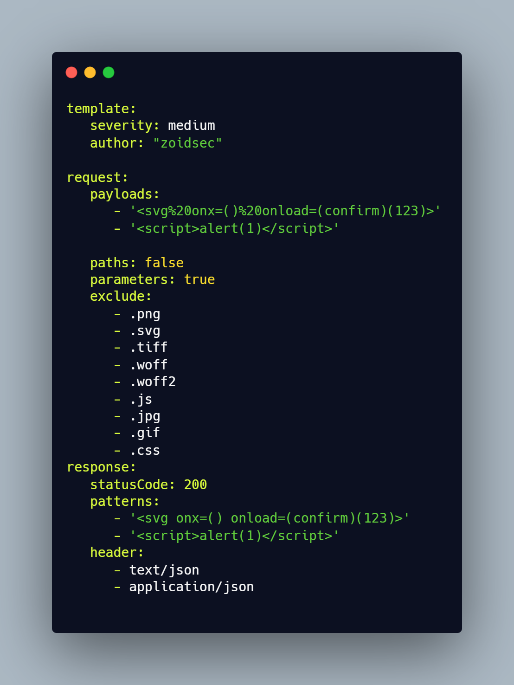

<h1 align="center">
  <br>

</h1>

<h4 align="center">Fast and customisable parameter based vulnerability scanner based on simple YAML Rules</h4>


<p align="center">
<a href="https://goreportcard.com/report/github.com/ethicalhackingplayground/erebus"></a>
<a href="https://github.com/ethicalhackingplayground/erebus/issues"></a>
<a href="https://github.com/ethicalhackingplayground/erebus/releases"></a>
<a href="https://twitter.com/z0idsec"></a>
<a href="https://discord.gg/MQWCem5b"></a>
</p>

---

Erebus is used to test every parameter across targets based on Yaml templates leading to zero false positives and providing fast scanning on large number of hosts. Erebus offers many useful features including an intercepting proxy which allows researchers to browse the web, click on links and erebus will test every parameter that passes through the proxy.

We have a [dedicated repository](https://github.com/ethicalhackingplayground/erebus/erebus-templates) that houses various types of vulnerability templates.


## How templates work


<h3 align="center">
  </a>
</h3>


<<<<<<< HEAD
## Install Erebus Binary

```sh
▶  GO111MODULE=on go get -u -v github.com/ethicalhackingplayground/erebus/erebus
=======
# Install Erebus Binary

```sh
▶  GO111MODULE=on go get -u -v github.com/ethicalhackingplayground/erebus/erebus
```

# Install Erebus From Github

```sh
▶  git clone https://github.com/ethicalhackingplayground/erebus ; cd erebus/erebus; go build ; sudo cp erebus /bin
>>>>>>> main
```

## Install Erebus From Github

```sh
▶  git clone https://github.com/ethicalhackingplayground/erebus ; cd erebus/erebus ; go build ; sudo cp erebus /bin
```

<table>
<tr>
<td>  

## Setting up the Erebus Interceptor

Make sure to setup a proxy in your browser before you use the **erebus interceptor** for firefox go to 

▶ Settings ▶ General ▶ Network Settings ▶ Manual proxy configuration

type in **127.0.0.1** in HTTP Proxy then for the port type in **8080** make sure to enable **Also use this proxy for FTP and HTTPS**

</td>
</tr>
</table>

<table>
<tr>
<td> 

## Install the SSL Certificates to use TLS

I have provided the certificates for you to use for **HTTPS** testing, all you need to do is install these by:

▶ Settings ▶ Privacy & Security ▶ Certificates ▶ View Certificates ▶ Import ▶ 

Select the **.crt** file in the erebus directory and proceed by trusting and installing.

</td>
</tr>
</table>


<table>
<tr>
<td>  

### Download Templates

All the available **erebus-templates** from [Github project](https://github.com/ethicalhackingplayground/erebus/tree/main/erebus-templates), are here and ready to use.

</td>
</tr>
</table>


### Usage

```sh
erebus -h
```

This will display help for the tool. Here are all the switches it supports.

<details>
<summary> 👉 erebus help menu 👈</summary>

```
Usage of ./erebus:
  -burp-sitemap string
        scan burp xml sitemap (without base64 decoded)
  -c int
        the number of concurrent requsts (default 100)
  -crawl
        crawl through each intercepted request (default true)
  -depth int
        the crawl depth (default 5)
  -interceptor
        intercept the requests through the proxy and test each parameter
  -o string
        output results to a file
  -p string
        the port on which the interception proxy will listen on (default "8080")
  -scope string
        the scope for the proxy intercetor
  -secure
        determaines if the connection is secure or not
  -silent
        silent (only show vulnerable urls)
  -t string
        use the templates with all our yaml rules instead
  -tc string
        Use other tools by executing an os command (default "qsreplace")
```

</details>

### Running Erebus

Scanning for XSS vulnerabilities using the intercepting proxy while crawling.

```sh
▶ erebus -t erebus-templates/xss-reflected.yaml -interceptor -crawl -secure
```

[](https://asciinema.org/a/424487)

### License

Erebus is distributed under [GPL-3.0 License](https://github.com/ethicalhackingplayground/erebus/blob/main/LICENSE)

<h1 align="left">
  <a href="https://discord.gg/MQWCem5b"></a>
</h1>
