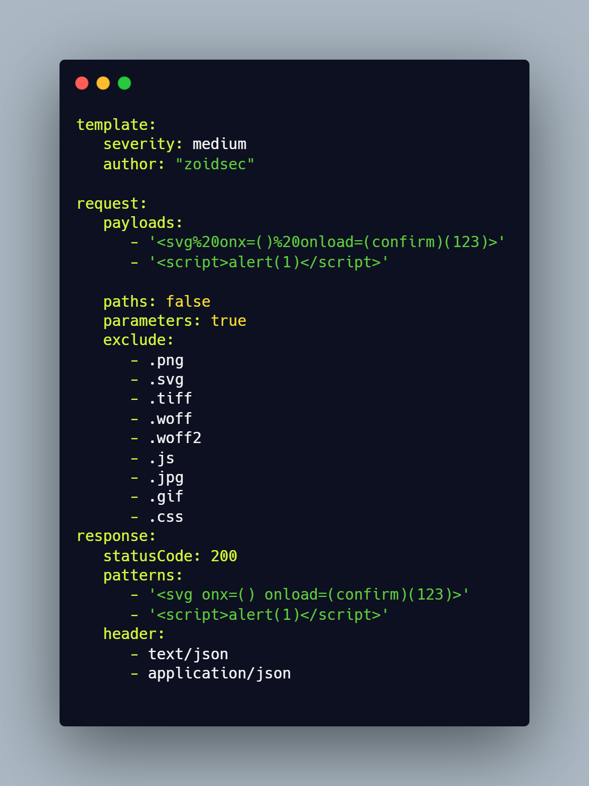

<h1 align="center">
  <br>

</h1>

<h4 align="center">Fast and customisable parameter based vulnerability scanner based on simple YAML Rules</h4>


<p align="center">
<a href="https://goreportcard.com/report/github.com/ethicalhackingplayground/erebus"></a>
<a href="https://github.com/ethicalhackingplayground/erebus/issues"></a>
<a href="https://github.com/ethicalhackingplayground/erebus/releases"></a>
<a href="https://twitter.com/z0idsec"></a>
<a href="https://discord.gg/MQWCem5b"></a>
</p>

<p align="center">
  <a href="#how-templates-work">How</a> •
  <a href="#install-erebus">Install</a> •
  <a href="#erebus-templates">Templates</a> •
  <a href="#setup-erebus-interceptor">Interceptor</a> •
  <a href="#usage">Usage</a> •
  <a href="https://discord.gg/MQWCem5b">Join Discord</a> 
</p>

---

Erebus is used to test every parameter across targets based on Yaml templates leading to zero false positives and providing fast scanning on large number of hosts. Erebus offers many useful features including an intercepting proxy which allows researchers to browse the web, click on links and erebus will test every parameter that passes through the proxy.

We have a [dedicated repository](https://github.com/ethicalhackingplayground/erebus-templates) that houses various types of vulnerability templates.


## How templates work


<h3 align="center">
  </a>
</h3>


## Install Erebus

```sh
▶  GO111MODULE=off go get -u -v github.com/ethicalhackingplayground/erebus/erebus
```

## Install Templates

```sh
▶  erebus -ut
```

## Erebus Templates

Erebus has had built-in support for automatic update/download templates (https://github.com/ethicalhackingplayground/erebus/releases/latest). [**Erebus-Templates**](https://github.com/ethicalhackingplayground/erebus-templates) project provides a community-contributed list of ready-to-use templates that can be used with part of your testing.

You may use the `-ut` flag to update the nuclei templates at any time.


## Setup Erebus Interceptor

Make sure to setup a proxy in your browser before you use the **erebus interceptor** for firefox go to 

```sh
▶ Settings ▶ General ▶ Network Settings ▶ Manual proxy configuration
```

type in **127.0.0.1** in HTTP Proxy then for the port type in **8080** make sure to enable **Also use this proxy for FTP and HTTPS**

## Install the SSL Certificates to use HTTPS

I have provided the certificates for you to use for **HTTPS** testing, all you need to do is install these by:

```sh
▶ Settings ▶ Privacy & Security ▶ Certificates ▶ View Certificates ▶ Import ▶ 
```

Select the **.crt** file in the erebus directory and proceed by trusting and installing.

## Usage

```sh
erebus -h
```

This will display help for the tool. Here are all the switches it supports.

```sh
Usage of erebus:
  -burp-sitemap string
        scan burp xml sitemap (without base64 decoded)
  -c int
        the number of concurrent requsts (default 100)
  -crawl
        crawl through each intercepted request
  -depth int
        the crawl depth (default 5)
  -interceptor
        intercept the requests through the proxy and test each parameter
  -o string
        output results to a file
  -p string
        the port on which the interception proxy will listen on (default "8080")
  -scope string
        the scope for the proxy intercetor
  -secure
        determaines if the connection is secure or not
  -silent
        silent (only show vulnerable urls)
  -t string
        use the templates with all our yaml rules instead
  -tc string
        Use other tools by executing an os command (default "qsreplace")
  -ut
        Install or update the erebus-templates
```


## Usage

Here are a few examples on how to use the erebus scanner for part of your testing.

## Intercept and Crawl on HTTP

Scanning for XSS vulnerabilities using the intercepting proxy with all of paypal inscope while crawling on HTTP domains.

```sh
▶ erebus -t erebus-templates/xss-reflected.yaml -interceptor -crawl -scope ".*.\.paypal.com"
```

## Intercept and Crawl on HTTPS

Scanning for XSS vulnerabilities using the intercepting proxy with all of paypal inscope while crawling on HTTPS domains.

```sh
▶ erebus -t erebus-templates/xss-reflected.yaml -interceptor -crawl -secure -scope ".*.\.paypal.com"
```

## Tool Chaining Usage

Scanning for XSS vulnerabilities across range of subdomains using subfinder and Gau

```sh
▶ echo "paypal.com" | gau | erebus -t erebus-templates/xss-reflected.yaml
```

Scan subdomains from a file in the format **https://** or **http://**

```sh
▶ cat alive | gau | erebus -t erebus-templates/xss-reflected.yaml
```


[](https://asciinema.org/a/424487)

### License

Erebus is distributed under [GPL-3.0 License](https://github.com/ethicalhackingplayground/erebus/blob/main/LICENSE)

<h1 align="left">
  <a href="https://discord.gg/MQWCem5b"></a>
</h1>
